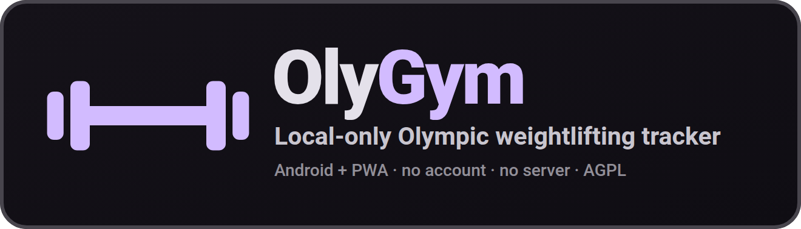
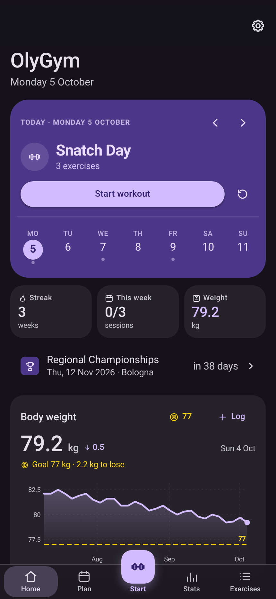
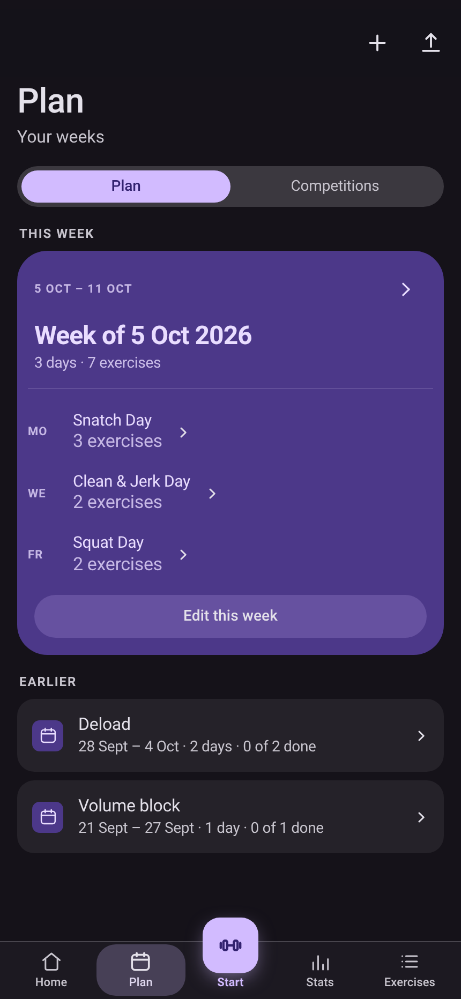
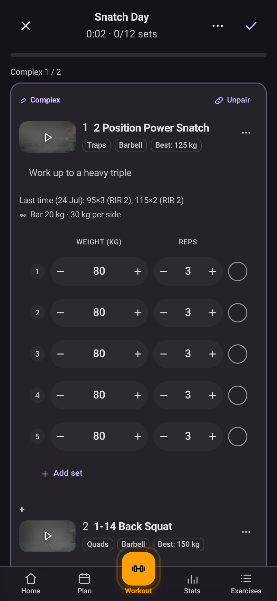
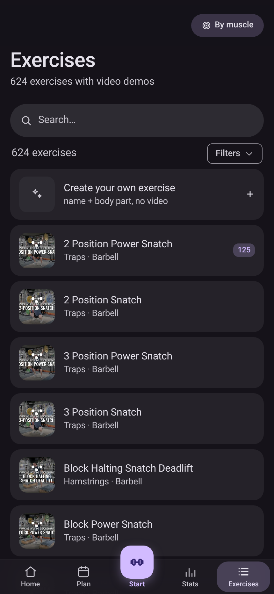
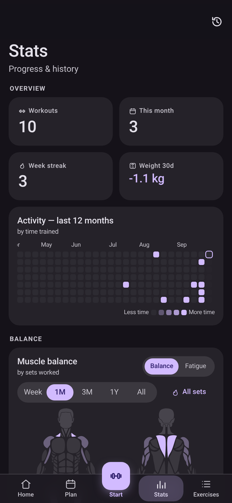
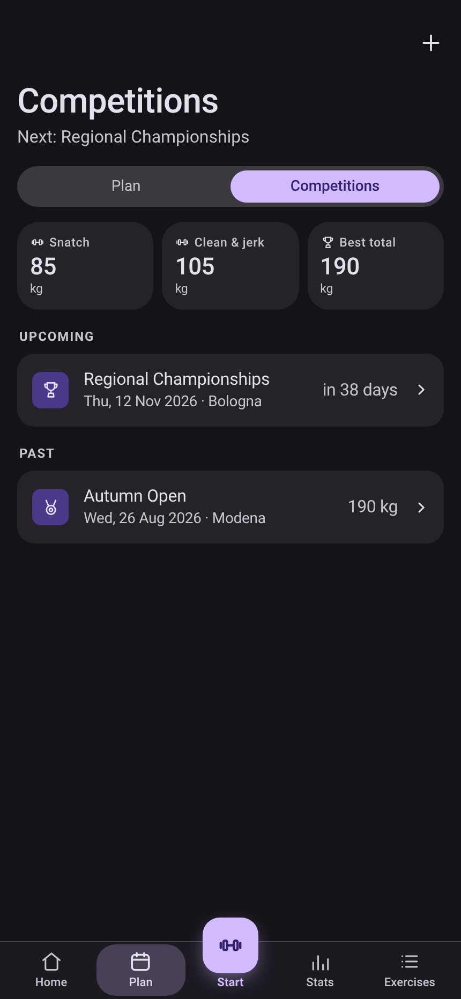

<div align="center">



<br>

**A local-only Olympic weightlifting tracker for Android and the browser.**

Plan the week the way your coach writes it, run guided workouts, and track every lift and your
body weight over time, all on your own device. No account, no server, no subscription, no ads, no
telemetry.

<br>

**AGPL-3.0 · Android app + installable PWA · React 19 · no account, no server**

</div>

<br>

<div align="center">
<table>
<tr>
<td align="center"><br><sub><b>Home</b> · today's session and weight</sub></td>
<td align="center"><br><sub><b>Plan</b> · the current week, and the ones behind it</sub></td>
<td align="center"><br><sub><b>Workout</b> · a complex, its sets and its video</sub></td>
<td align="center"><br><sub><b>Library</b> · the full Catalyst catalogue</sub></td>
<td align="center"><br><sub><b>Stats</b> · heatmap, muscle balance and PRs</sub></td>
<td align="center"><br><sub><b>Competitions</b> · the meets, and the totals they gave</sub></td>
</tr>
</table>
</div>

<br>

## What it is

OlyGym is a personal fork of [openGym](https://github.com/DuarteSantos8/openGym), pointed at
Olympic weightlifting and pared back to a single-user app that never talks to a server. The
training did not fit the tool: the catalogue was generic gym work, the plan lived in a coach's
spreadsheet, and neither of them wanted to become a feature request. So the catalogue was replaced,
the plan import was built, and everything that needed a server was stripped out.

What is left is one app on one device. No account, no login, no sync, no push, no telemetry. It
ships as a signed Android app through Capacitor and as an installable PWA built from the same React
source.

## What the fork changes

### The catalogue is the sport, not the gym

624 lifts and drills from [Catalyst Athletics](https://www.catalystathletics.com/exercises/),
sorted into the ten movement families the training actually uses: snatch, clean, jerk, trunk,
jumping and plyometrics, carries, accessories for the lower body, upper body and prehab, and
general work. Every entry carries its description, muscle tags, equipment and the link to its demo
video.

### The coach's spreadsheet becomes a plan

Point the app at his `.xlsx`, from the device or from Google Drive. One sheet per week, his
exercises, sets, reps and loads. His exercises are matched against the catalogue, and anything the catalogue has no word for stays in a
note, in his words. You review every row before it becomes a routine, and a correction you make
once is remembered for the next week.

### A complex is one thing

Movements he writes with `+` are one card with one set count and one load, in the routine editor
and in the workout, because that is how they are trained.

### The demo video is a layer of its own

Every exercise shows the poster frame of its video, hotlinked from YouTube by your browser. Tap it
and the player opens, or have it load with the exercise, or keep it off entirely. This fork ships
no media at all.

### Material 3 Expressive

Tonal surfaces, springs and flowing progress bars, a tab bar with a real indicator, light and dark
themes and eight accent colours, all over a hand-drawn icon set.

### Local-only by design

There is no server to sign in to. The Android app adds a native workout reminder, a file mirror and
an in-app updater, and nothing that phones home.

## Features

### Plan the week

- A routine for each weekday, or several in one day that run back to back as a single session.
- Four starter plans (Push/Pull/Legs, Upper/Lower, Full Body, 5×5) load as ordinary routines you can
  edit, and any routine copies in one tap.
- Reschedule a single day when you are sick, miss a session or have fewer gym days that week,
  without touching the weekly plan.
- Choose whether the week starts on Monday or Sunday. The weekly plan, the day strip on Home, the
  calendar and every "this week" total follow it, so the app reads the way the calendar on your
  wall does.
- Print your routines and week schedule as a clean PDF.
- Combine routines into one session from the workout header, or set up a day in the planner that
  holds several. See **[docs/COMBINE_ROUTINES.md](docs/COMBINE_ROUTINES.md)**.

### Find the lift

- Search the 624-lift catalogue by name, and browse it by movement family, equipment or muscle.
- Filter the library by the equipment you actually own. The options adapt to what you have picked,
  so every combination on screen has results behind it.
- Read the muscle map as a front-and-back body diagram, on a male or female figure.
- Star the exercises you use, and they sort first in the picker and the library.
- Add your own exercises with a name and a body part. They behave like built-in ones everywhere,
  with an optional description in place of a video.

### Run the workout

- The app knows what day it is and starts today's session. It asks your body weight first, pre-fills
  your weights in absolute kilograms from last time, runs the rest timer, detects best-lift PRs and
  tracks each exercise's working weight. On a rest day it names when your next session is and what
  it is.
- One ⋯ menu per exercise holds the note, details, bar weight, warm-up, complex, swap, move and
  remove actions. The set number is its own menu, and a scrollable list view shows the whole session
  with the header pinned. Four switches under Settings → Workout controls bring any of the old
  button rows back. See **[docs/LIST_VIEW.md](docs/LIST_VIEW.md)**.
- Log how hard a set felt in one tap. RIR and RPE share one colour scale, with a sentence per level
  and a free field for in-between values.
- Plan a complex into a routine, or pair two exercises mid-session with "make complex with
  previous/next", then work through the group back to back with a single rest at the end of each
  round. A complex shows as one card with its shared sets and load and its movements numbered
  inside. Unpair at any time, and a group of one dissolves itself.
- Mark the ramp-up rows as warm-up sets, and they stay out of the numbers that should not see them
  while still being there in the session. A weight change cascades down the rows that share their
  phase.
- Add an exercise you decided to do, or remove one you did not, without ending the workout.
  Removing a member of a complex asks which one.
- Log planks, hangs, wall sits and loaded carries by time instead of reps, with a work timer that
  counts the set itself and records the time you actually held. They can carry weight too.
- Give any exercise its own rest time, and it overrides the global timer for that exercise. A
  complex rests once, taking the longest.
- Bodyweight exercises arrive knowing they carry no load, so there is no weight column and no
  working-weight prompt. Add a dip belt and the app reads it as an addition.
- Barbell, EZ, trap bar and Smith machine work carries a bar weight (20 kg and friends, or your own
  per exercise), and the workout screen tells you what goes on each side. You still log the total,
  so history and PRs keep meaning exactly what they always did.
- Check the exercise's last sessions and its best-lift PR from the ⋯ menu or the exercise details,
  without leaving the workout.
- Choose how much media you want during a workout. The frame can be full size, small or hidden, and
  the video can be a button, inline or off.
- Keep the screen awake for as long as a workout is running, released the moment you finish it, and
  switchable off in Settings.
- Turn on a screen flash when a rest or work timer finishes, for loud gyms and headphones.

### Track the training

- Chart your body weight with a goal line you set, and colour gains and losses by whether they move
  toward it.
- See a GitHub-style year heatmap shaded by time spent training, with a week streak.
- Read the muscle map as Balance (where the volume went over a week, a month or all time, naming the
  muscles you have not trained) or Fatigue (what is still recovering, weighted by how close each set
  was to your best and decaying smoothly rather than expiring at a window edge). It previews what a
  routine hits while you build it, and shows what you just trained when you finish.
- Keep a competition log apart from the training log. Add the meet you are training for with its
  date, place and weight class, then log up to three snatch and three clean & jerk attempts, each
  good or no lift. The screen keeps upcoming and past meets and rolls up your best snatch, best
  clean & jerk and best total. A meet is an event with a total, not a session with sets, so it never
  touches your training days.
- Log a past workout when you forgot your phone or trained on paper. Add date, start time, duration
  and routine or freestyle, then the normal workout screen, weights, reps, RIR/RPE, timed sets and
  all. If that day already has a workout, you choose whether to replace it, keep both or cancel.
- Train freestyle, without a plan. Each exercise arrives prefilled from the last time you did it,
  same sets, same reps and weight by position, so an unplanned session does not start by asking you
  to retype last week.

### Your data and the app

- One-tap JSON export and import, plus automatic backups. On Android backups go out through the OS
  share sheet.
- Italian and English, loaded on demand so the app stays fast.
- Light and dark themes, eight accent colours and a male or female body map, saved to your profile.
- A local workout-day reminder on Android. On days with a planned workout and nothing logged, the
  app schedules a native local notification per calendar date, so a day you already trained or
  rescheduled stays quiet. No server, no push service.
- A standalone Android app that wraps the same source: data on the phone, native reminders, offline
  PWA behaviour and an in-app APK updater. See **[docs/MOBILE.md](docs/MOBILE.md)**.

## Install

**Android.** Grab the signed APK the project's `build:apk` CI job publishes, or build and sign your
own. See **[docs/MOBILE.md](docs/MOBILE.md)**. Sideload it, allow the install once, and the app
checks for a newer build itself. No Play Store, no account.

**Browser / installed PWA.** The app is static files; there is no server component.

```sh
cd frontend
npm install
npm run build          # → frontend/dist
```

Serve `frontend/dist` over HTTP(S) with any static host, open it, and use *Add to Home Screen* to
install it. Without a host, `npm run preview` serves it locally.

Nothing is downloaded at runtime except the demo poster frames, which are hotlinked from YouTube.

> **About those pictures:** the catalogue in this fork comes from
> [Catalyst Athletics](https://www.catalystathletics.com/exercises/) (names, descriptions and the
> link to each exercise's video) and the videos are theirs, hosted on YouTube. This fork ships no
> media at all: the frame is fetched at runtime and nothing is stored. Their text and videos are
> under neither this project's AGPL nor any license granted to you. See [NOTICE.md](NOTICE.md).

## Your data

Everything lives on the device. In the browser the app keeps its state in `localStorage`; the
Android app mirrors the same state to `opengym-state.json` in the app's private storage on every
change, so an evicted WebView cache cannot lose it. Settings offers one-tap JSON export and import
and keeps automatic backups; backups go out through the OS share sheet on Android. There is no
server and no account, so clearing the app's data removes the data.

## Roadmap

[ROADMAP.md](ROADMAP.md) is upstream openGym's public roadmap, kept here for provenance only. This
fork has no releases of its own and does not follow that plan.

## Tech

React 19 + Vite (React Router, Zustand) · Capacitor (Android) · Vitest · exercise data from
[Catalyst Athletics](https://www.catalystathletics.com/exercises/); demo videos on YouTube, frames
hotlinked at runtime (see [License](#license)). No backend, no database server, no cloud
dependencies. Reading the coach's `.xlsx` uses the platform's own `DecompressionStream` and
`DOMParser` rather than a spreadsheet library, and the app itself ships no runtime dependencies
beyond React, the router, Zustand and the Capacitor plugins.

The training logic (how a logged session is read back, the muscle-recovery model, how the coach's
spreadsheet becomes routines) lives in pure functions under `frontend/src/lib/` with tests next to
them: `npm test` in `frontend/`.

Design notes live in [docs/MOBILE.md](docs/MOBILE.md),
[docs/DATA_IMPORTS.md](docs/DATA_IMPORTS.md),
[docs/COMBINE_ROUTINES.md](docs/COMBINE_ROUTINES.md) and [docs/LIST_VIEW.md](docs/LIST_VIEW.md).

## Credits & upstream

OlyGym is **[openGym](https://github.com/DuarteSantos8/openGym)** by **Duarte Santos**. The app, the
training logic and the original feature set are his work, under the AGPL. Nothing here would exist
without it.

- **[github.com/DuarteSantos8/openGym](https://github.com/DuarteSantos8/openGym)**: source, releases and issues
- **[opengym.duarte-santos.ch](https://opengym.duarte-santos.ch)**: upstream's site; its
  [Discord](https://discord.gg/e62jY6fwVb) and its
  [coffee button](https://buymeacoffee.com/duartesantos) are upstream's too, and belong to upstream
- **[CONTRIBUTING.md](CONTRIBUTING.md)**, [CHANGELOG.md](CHANGELOG.md), [ROADMAP.md](ROADMAP.md): upstream's, kept as they are

This fork is personal: no releases of its own, no Discord, and issues are upstream's to answer.

## License

**The code** is [GNU AGPL v3.0](LICENSE), free and open source. You can use, modify and share it,
and any modified version you distribute must stay under the same license.

**Third-party content is not, and this project cannot sublicense it.** The exercise catalogue in this
fork (names, movement categories, equipment, descriptions and the link to each demo video) comes
from [Catalyst Athletics](https://www.catalystathletics.com/exercises/), taken from their public
exercise pages; every entry cites the page it came from. Neither that text nor their videos are
covered by the AGPL or licensed to you by this project. No media is redistributed here: the app
hotlinks the video's poster frame from `img.youtube.com` at runtime and never stores it. To reuse
their text or video yourself, clear it with the rights holder first.

Full third-party notices, including the body-diagram geometry: **[NOTICE.md](NOTICE.md)**.
